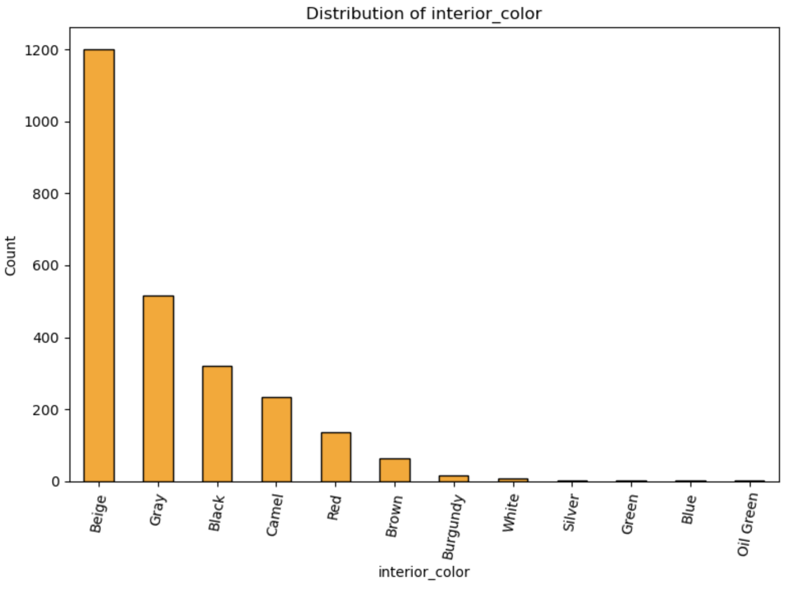
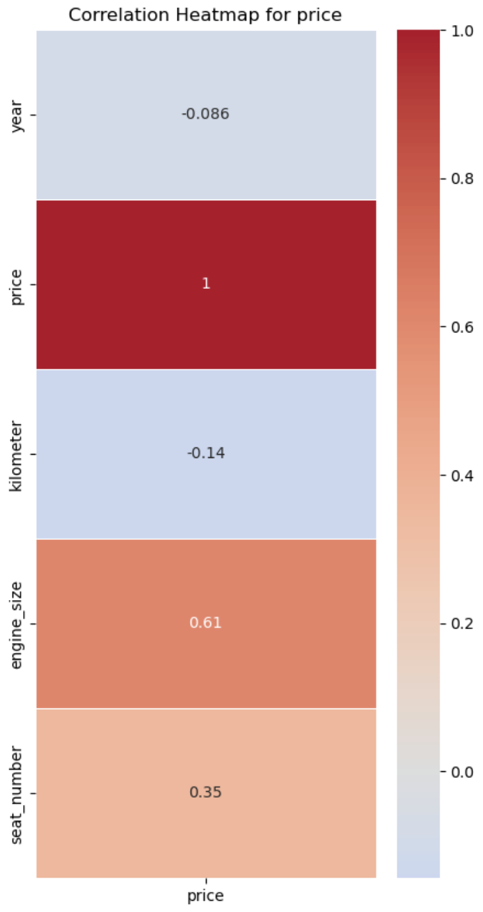

# thammenha
Tuwaiq Data Science &amp; Machine Learning Capstone

# Project Summary

The current situation in the Saudi Used Car Market is in dire need of tools and services to simplify the process of evaluating cars. This project aims to solve this using Machine Learning.

### Team Members:

 - Ahmed Alsubhi
 - Faisal Alzahrani
 - Salman Gassem
 - Ziyad Aljaser

## UI
For our website, we have the code in another repository, please follow this link: https://github.com/Ziyad-Aljaser/thammenha

 - Built using React and Flutter, the repo contains the backend and the frontend code.

# Part 1 of the project

### Problem Statement
Websites issues:
 1. Unregulated pricing.
 2. Personal opinions.
 3. Unreliable.

Going in person to the physical market also has its drawbacks:

 1. Evaluations are always below actual value.
 2. Unfair pricing.
 3. Can be easily taken advantage of.
 4. Inconvenient.
 5. Weeks to find out the market value
 6. Financial Overhead
 7. Time cost

## Solution

Develop a Machine Learning model that learns from the KSA Used Car market to be able to estimate the prices of used cars.

#### Objectives:
 - Collect local used car data.
 - Create a Machine Learning model using the data collected.
 - Develop a separate model on a separate dataset for comparison purposes.

#### Implementation Plan:
 - Deliver the service through a website.
 - Create an API for the model.
 - Users enter features to find their car’s value.

### Data Collection

 - The KSA data was scraped from the website Syarah.com.
 - Collected a dataset from the USA market to compare from websites such as Kaggle, Medium, and so on.

### Model Training

The best performant model was the KNN Model, which achieved an R2 Score of 73% on the test data, which better than the base model we built as shown below.

### EDA for the Saudi Data

The dataset consists of the following columns:

1. Brand
2. Model
3. Year
4. Price
5. Kilometer
6. Fuel Type
7. Gear Type
8. Engine Size
9. Drivetrain
10. Trim
11. Exterior Color
12. Interior Color
13. Seat Number
14. Origin

#### Insights

The Saudi market prefers White cars the most with Beige interior. Possibly due to the extreme heat weather.

And it seems as though the pricing does not seem to be related to the car's Kilometers as much as previously believed so. Perhaps people here value the car's brand the most when it comes to estimating the car's value?

<!--  -->

#### Initial Base Linear Regression model

#### Initial Base KNN model

# Part 2 of the project

### USA Model

Due to the low volume of the Saudi data, we opted to also showcase the potential of this project by bringing in a dataset of over 700k cars, and train a model.

### Dataset

This is the source of the dataset: https://www.kaggle.com/datasets/andreinovikov/used-cars-dataset

### Preprocessing the data

Due to the sheer size of the dataset, we decided to first drop all nulls and duplicates as a first step, and see how the model performs, which left us with approximately more than 220k rows, which proved to be more than enough to achieve a high R2 Score.

### Model

The model is a Rendom Forest model that achieved an R2 Score of 93% on the test set.

### Conclusion

The USA Model was abale to achieve such an impressive R2 Score due to the fact that it had more features, better data correlations, and higher number of rows. This proves the potential of applying this approach to the Saudi market once better, and higher quality data is collected.